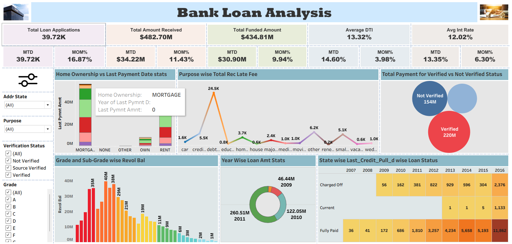
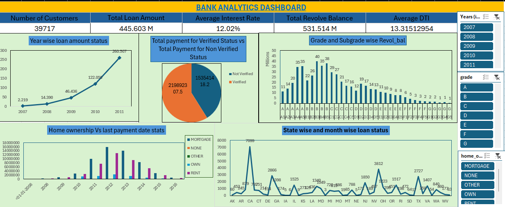

# 📊 Bank Loan Analytics Dashboard

## 📌 Project Overview

This project analyzes bank loan data to uncover insights related to customer behavior, loan performance, and financial risk.
Using Excel, Power BI, and Tableau, interactive dashboards were built to track KPIs, monitor loan trends, and support data-driven decision-making.
The analysis is based on real-world financial attributes such as loan amount, interest rate, repayment status, and customer demographics.

## 🎯 Objectives
- Analyze loan application trends over time
- Identify factors influencing loan approval and repayment
- Understand customer segmentation (income, home ownership, etc.)
- Evaluate loan risk using status like Charged Off, Fully Paid, Current
- Build interactive dashboards for business insights

## 🛠️ Tools & Technologies Used
Excel → Data cleaning, preprocessing, KPI dashboard
Power BI → Interactive dashboards and KPI tracking
Tableau → Advanced visual analysis
SQL → (Planned for querying, joins, and aggregations)

## 📂 Dataset Description
The project uses two datasets:

### 🔹 Finance_1.csv (Customer & Loan Details)

Includes key attributes such as:

loan_amnt → Loan amount requested
funded_amnt → Funded loan amount
term → Loan duration
int_rate → Interest rate
grade, sub_grade → Loan grading
home_ownership → Ownership status (Rent, Own, Mortgage, etc.)
annual_inc → Customer annual income
verification_status → Verified / Not Verified
loan_status → Fully Paid, Charged Off, Current
purpose → Loan purpose
addr_state → Customer state
dti → Debt-to-Income ratio

### 🔹 Finance_2.csv (Financial Behavior & Repayment)

Includes advanced financial metrics:

revol_bal → Revolving balance
revol_util → Credit utilization ratio
total_pymnt → Total payment made
total_rec_prncp → Principal received
total_rec_int → Interest received
total_rec_late_fee → Late fees
last_pymnt_amnt → Last payment amount
last_credit_pull_d → Last credit check

## 📊 Dashboard Overview

### 🔹Key KPIs

Total Customers: 39,717
Total Loan Amount: 446M+
Average Interest Rate: 12.02%
Total Revolve Balance: 531M+
Average DTI: 13.32

### 🔹Power BI Dashboard

Key Features:
KPI cards (loan amount, customers, interest rate, DTI)
Year-wise loan growth analysis (2007–2011 📈)
Verified vs Non-Verified payment comparison
Home ownership segmentation
Grade & sub-grade analysis of revolving balance

### 🔹Tableau Dashboard

Key Features:
MTD & MOM performance metrics
Purpose-wise late fee analysis
State-wise loan status distribution
Verification status comparison
Grade-wise revolving balance

### 🔹Excel Dashboard

Key Features:
Interactive slicers (Year, Grade, Home Ownership)
KPI summary dashboard
Loan distribution and trend analysis
Pivot-based reporting

## 📈 Key Insights

- Loan disbursement shows steady growth from 2007 to 2011
- Verified customers contribute significantly higher repayments
- Customers with Mortgage ownership dominate loan distribution
- Grades B and C have higher revolving balances, indicating moderate risk
- States show variation in loan repayment and default patterns
- Fully Paid loans exceed Charged Off → indicating overall positive repayment trend

## 🧠 Business Impact

Helps financial institutions identify high-risk customers
Improves credit risk assessment using loan status & DTI
Enables better segmentation using income, grade, and ownership
Supports strategic lending decisions

## 📁 Repository Structure

Bank-Loan-Analytics/
│── Dataset/              # Finance_1.csv, Finance_2.csv
│── Excel/                # Excel dashboard
│── Power BI/             # Power BI (.pbix)
│── Tableau/              # Tableau (.twbx)
│── Screenshots/          # Dashboard images
│── README.md             # Documentation

## 🚀 Future Enhancements

- Implement SQL queries for:
   - Data extraction
   - Joins between datasets
   - Aggregations (SUM, AVG, GROUP BY)
-Build automated data pipeline
- Add predictive model for loan default

## 👨‍💻 Author
Mitra Bhanu Barik
📧 Email: [mitrabhanu.b2000@gmail.com](mailto:mitrabhanu.b2000@gmail.com)
🔗 LinkedIn: [View Profile](https://www.linkedin.com/in/mitrabhanubarik/)
💼 Aspiring Data Analyst

## ⭐Support
If you found this project useful, give it a ⭐ on GitHub and connect with me!
